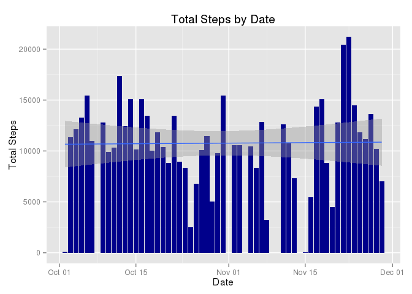
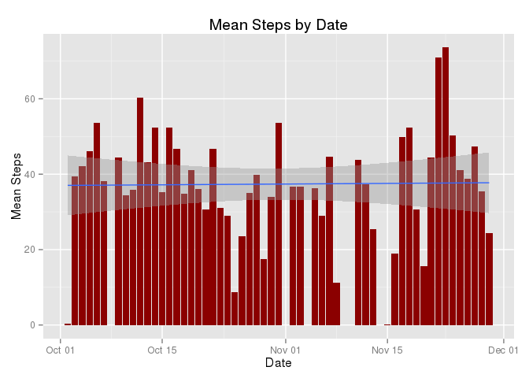
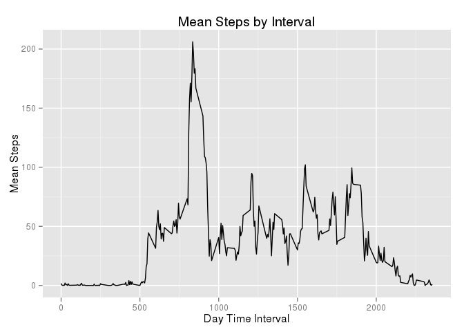
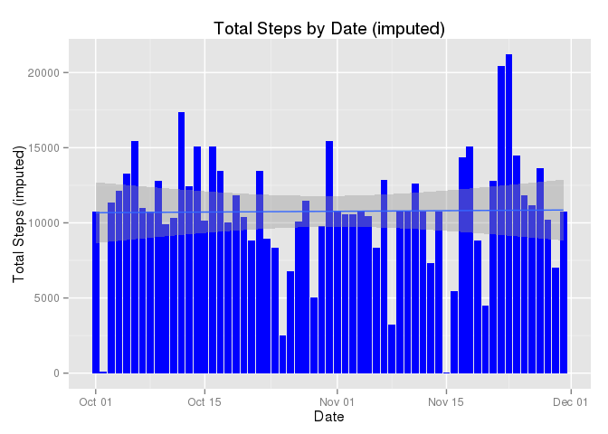
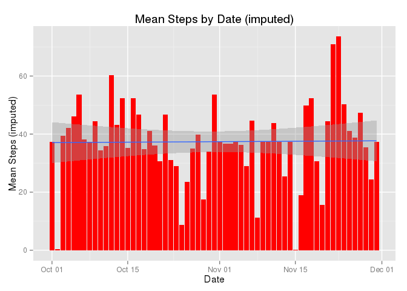
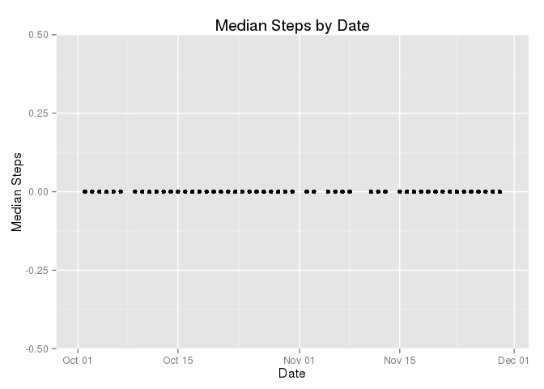
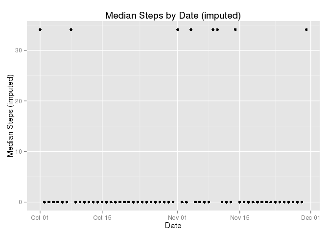
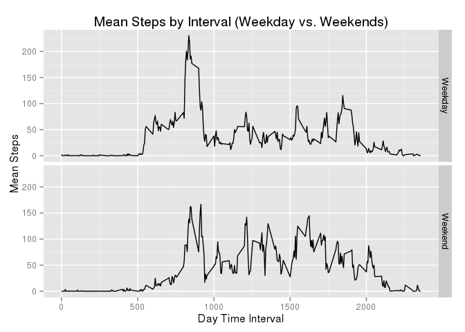

# Reproducible Research: Peer Assessment 1


## Loading and preprocessing the data

The raw data file "activity.zip" should be in the working directory:


```r
unzip("activity.zip")
rawActiv <- read.csv("activity.csv")
str(rawActiv)
```

```
## 'data.frame':	17568 obs. of  3 variables:
##  $ steps   : int  NA NA NA NA NA NA NA NA NA NA ...
##  $ date    : Factor w/ 61 levels "2012-10-01","2012-10-02",..: 1 1 1 1 1 1 1 1 1 1 ...
##  $ interval: int  0 5 10 15 20 25 30 35 40 45 ...
```

### Preprocessing

Use the Lubridate R package to convert the date "factor" into a date which allows ggplot to handle it better automatically.


```r
require(lubridate)
```

```
## Loading required package: lubridate
```

```r
rawActiv$date <-ymd(rawActiv$date)
str(rawActiv)
```

```
## 'data.frame':	17568 obs. of  3 variables:
##  $ steps   : int  NA NA NA NA NA NA NA NA NA NA ...
##  $ date    : POSIXct, format: "2012-10-01" "2012-10-01" ...
##  $ interval: int  0 5 10 15 20 25 30 35 40 45 ...
```


## What is mean total number of steps taken per day?

I will use dplyr to transform the data & ggplot2 for plotting.


```r
require(dplyr)
```

```
## Loading required package: dplyr
## 
## Attaching package: 'dplyr'
## 
## The following objects are masked from 'package:lubridate':
## 
##     intersect, setdiff, union
## 
## The following object is masked from 'package:stats':
## 
##     filter
## 
## The following objects are masked from 'package:base':
## 
##     intersect, setdiff, setequal, union
```

```r
require(ggplot2)
```

```
## Loading required package: ggplot2
```


### Make a histogram of the total number of steps taken each day


```r
meanSteps <- rawActiv %>% group_by(date) %>% 
    summarise_each(funs(sum, mean, median), steps)

p <- ggplot(meanSteps, aes(x = date, y = sum))
p <- p + geom_bar(stat="identity", fill = "darkblue") + 
    ggtitle("Total Steps by Date") + 
    xlab("Date") + ylab("Total Steps")

p + geom_smooth(method="lm")
```

```
## Warning: Removed 8 rows containing missing values (stat_smooth).
```

```
## Warning: Removed 8 rows containing missing values (position_stack).
```

 

### Calculate and report the mean and median total number of steps taken per day


```r
q <- ggplot(meanSteps, aes(x = date, y = mean))
q <- q + geom_bar(stat="identity", fill = "darkred") + 
    ggtitle("Mean Steps by Date") + 
    xlab("Date") + ylab("Mean Steps")

r <- ggplot(meanSteps, aes(x = date, y = median))
r <- r + 
    geom_point(fill = "brown") +
    ggtitle("Median Steps by Date") + 
    xlab("Date") + ylab("Median Steps")

q + geom_smooth(method="lm")
```

```
## Warning: Removed 8 rows containing missing values (stat_smooth).
```

```
## Warning: Removed 8 rows containing missing values (position_stack).
```

 

The median steps are 0, because the majority of 5 minute intervals have no steps.


```r
r 
```

```
## Warning: Removed 8 rows containing missing values (geom_point).
```

 


## What is the average daily activity pattern?

1. Make a time series plot (i.e. type = "l") of the 5-minute interval (x-axis) and the average number of steps taken, averaged across all days (y-axis)

    Summarise only non-missing data.


```r
meanInterval <- rawActiv %>% filter(!is.na(steps)) %>% 
    group_by(interval) %>% summarise_each(funs(mean), steps)

s <- ggplot(meanInterval, aes(y = steps, x = interval))

s + geom_line() + ggtitle("Mean Steps by Interval") + 
    xlab("Day Time Interval") + ylab("Mean Steps")
```

 

2. Which 5-minute interval, on average across all the days in the dataset, contains the maximum number of steps? 
**835**


```r
meanInterval[meanInterval$steps == max(meanInterval$steps),]
```

```
## Source: local data frame [1 x 2]
## 
##   interval    steps
## 1      835 206.1698
```

## Imputing missing values

1. Calculate and report the total number of missing values in the dataset (i.e. the total number of rows with NAs)  
**2304**

    count() is a dplyr function


```r
count(rawActiv[is.na(rawActiv$steps),])
```

```
## Source: local data frame [1 x 1]
## 
##      n
## 1 2304
```

2. Devise a strategy for filling in all of the missing values in the dataset. The strategy does not need to be sophisticated. For example, you could use the mean/median for that day, or the mean for that 5-minute interval, etc.

    - I will replace NA step values with the mean values for that time interval

3. Create a new dataset that is equal to the original dataset but with the missing data filled in.

    - The new dataset is called "rawActivReplNA"
    - (please forgive me for not seeing a vectorized solution to this)


```r
rawActivReplNA <- rawActiv

for ( s in 1:dim(rawActiv)[1]) {
    if ( is.na(rawActiv[s, "steps"]) ) {
        sInterval <- rawActiv$interval[s]
        mIntervalSteps <- meanInterval[meanInterval$interval == sInterval,"steps"]
        rawActivReplNA[s,"steps"] <- mIntervalSteps
    }
}
```

4. Make a histogram of the total number of steps taken each day and Calculate and report the mean and median total number of steps taken per day. Do these values differ from the estimates from the first part of the assignment? What is the impact of imputing missing data on the estimates of the total daily number of steps?

    - My method of handling the missing data was to **replace missing step values with the mean step value for that time interval overall**.  This has the effects:

        1. of increasing the sum of step counts for dates with missing step intervals.
        2. increasing the mean step counts for dates with missing step intervals
        3. I still don't understand how the median value result is coming out
        exactly.

    - Repeat the analysis for the new dataset with missing values "imputed".


```r
meanSteps <- rawActivReplNA %>% group_by(date) %>% 
    summarise_each(funs(sum, mean, median), steps)

p2 <- ggplot(meanSteps, aes(x = date, y = sum))
p2 <- p2 + geom_bar(stat="identity", fill = "blue") + 
    ggtitle("Total Steps by Date (imputed)") + 
    xlab("Date") + ylab("Total Steps (imputed)")

q2 <- ggplot(meanSteps, aes(x = date, y = mean))
q2 <- q2 + geom_bar(stat="identity", fill = "red") + 
    ggtitle("Mean Steps by Date (imputed)") + 
    xlab("Date") + ylab("Mean Steps (imputed)")

r2 <- ggplot(meanSteps, aes(x = date, y = median))
r2 <- r2 + 
#    geom_bar(stat="identity", fill = "yellow") + 
    geom_point(fill = "yellow") +
    ggtitle("Median Steps by Date (imputed)") + 
    xlab("Date") + ylab("Median Steps (imputed)")
```

#### Notice how some empty dates are filled with total steps and mean steps rise to the overall mean level by my method of imputing missing values.  See November 1st.


```r
par(mfrow = c(2,1))
p + geom_smooth(method="lm")
```

```
## Warning: Removed 8 rows containing missing values (stat_smooth).
```

```
## Warning: Removed 8 rows containing missing values (position_stack).
```

 

```r
p2 + geom_smooth(method="lm")
```

 

```r
par(mfrow = c(2,1))
q + geom_smooth(method="lm")
```

```
## Warning: Removed 8 rows containing missing values (stat_smooth).
```

```
## Warning: Removed 8 rows containing missing values (position_stack).
```

 

```r
q2 + geom_smooth(method="lm")
```

 


```r
par(mfrow = c(2,1))
r
```

```
## Warning: Removed 8 rows containing missing values (geom_point).
```

 

```r
r2
```

 


## Are there differences in activity patterns between weekdays and weekends?

### Yes


- Use lubridate wday function to add a day of the week variable and flag.
- Sun < Mon < Tues < Wed < Thurs < Fri < Sat


```r
rawActiv2 <- rawActivReplNA %>% 
    mutate(dayOfWeek = wday(date, label=T)) %>%
    mutate(Weekday = ifelse(dayOfWeek %in% c("Sun","Sat"),
                            "Weekend","Weekday"))

meanInterval <- rawActiv2 %>% 
    group_by(interval, Weekday) %>% 
    summarise_each(funs(mean), steps)

s <- ggplot(meanInterval, aes(y = steps, x = interval))
```

#### There is more early morning activity and less later day activity on weekdays.

#### There is less early morning activity and more even activity through the day on weekends.


```r
s + geom_line() + facet_grid(Weekday ~ .) +
    ggtitle("Mean Steps by Interval (Weekday vs. Weekends)") + 
    xlab("Day Time Interval") + ylab("Mean Steps")
```

 

